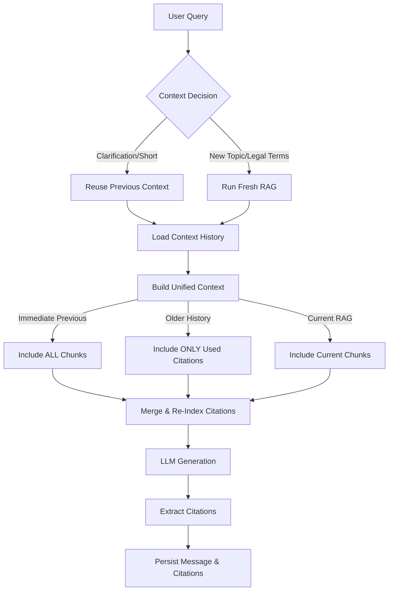

# Chat Service (`LangGraphChatService`)

## Overview

The **Chat Service** orchestrates the conversational AI experience. It manages the context window for the LLM to ensure consistency across multiple turns, decides when to reuse previous context versus running a new RAG search, and maintains a unified history of citations.

**Location**: `src/application/chat_service.py` (Service), `src/ai/graph/` (LangGraph Workflow)

---

## 1. Core Problem Solved

In a standard RAG chat, each new query typically triggers a fresh search, discarding previous context. This causes issues for:
1.  **Follow-up questions** (e.g., "Are you sure?"): The new RAG search might return irrelevant chunks, losing the original context.
2.  **Multi-turn reasoning**: The LLM forgets article text it just cited if that text isn't re-retrieved.
3.  **Citation tracking**: Citations from previous turns become invalid if not tracked correctly.

This system solves this by:
-   **Configurable History**: Keeping `n` previous turns of context.
-   **Intelligent Reuse**: Detecting follow-ups to reuse specific context.
-   **Unified Citations**: Merging citations from history and current RAG into a single, sequential list.

---

## 2. System Architecture



---

## 3. Workflow & Logic

### A. Context Decision Logic
**File:** `src/ai/context_decision.py`

Before running RAG, the system evaluates the query:
1.  **Heuristics**:
    *   Query length < 6 words?
    *   Contains specific clarification phrases ("¿seguro?", "¿estás seguro?", "explícame más")?
    *   **Result**: Skip RAG, reuse previous context.
2.  **Semantic Similarity** (if simple heuristics fail):
    *   Compare query embedding against a ChromaDB store of known clarification phrases.
    *   Similarity > 0.85?
    *   **Result**: Skip RAG, reuse previous context.
3.  **Content Check**:
    *   Contains legal keywords (`artículo`, `ley`, `código`)?
    *   **Result**: Force fresh RAG (likely a new lookup).

### B. History Retrieval
**File:** `src/infrastructure/sqlite/conversation_repository.py` function `get_context_history(n)`

Retrieves the last `n` assistant messages. For each:
*   **`context_json`**: The raw JSON list of chunks used for that message (retrieved only for the immediate previous message).
*   **`citations`**: The specific citations the LLM *actually used* in that message (retrieved for all history).

### C. Unified Context Construction
**File:** `src/ai/graph/nodes.py` function `build_citations_node`

This is the core logic that builds the prompt context. It iterates through:

1.  **Immediate Previous Context**:
    *   Takes the **full** `context_json` (all chunks available to the LLM in the last turn).
    *   Rationale: The user is likely asking about something the LLM "knows" from the immediate context, even if it wasn't cited.
    *   Label: `=== CONTEXTO PREVIO INMEDIATO ===`

2.  **Older History (2+ turns ago)**:
    *   Takes **only** the `citations` that were used.
    *   Rationale: Save context window space; only keep what was important enough to cite.
    *   Label: `=== CONTEXTO HISTÓRICO (hace {n} turnos) ===`

3.  **Current RAG Context** (if fresh RAG ran):
    *   Takes the new chunks retrieved for the current query.
    *   Label: `=== CONTEXTO ACTUAL ===`

**CRITICAL STEP: Unification**
All chunks from these 3 sources are flattened into a single list and assigned sequential indices (`[1]`, `[2]`, `[3]`...). This means the LLM sees a single continuous list of references, regardless of where they came from.

---

## 4. Data Models & Inputs/Outputs

### Input
The `build_citations_node` receives the `ChatGraphState`:
```python
class ChatGraphState(TypedDict):
    query: str
    previous_context: Optional[str]        # Immediate previous context (raw JSON)
    context_history: List[Dict[str, Any]]  # List of {context_json, citations, is_immediate}
    chunks: List[Dict[str, Any]]           # New RAG chunks (if any)
    skip_collector: bool                   # Decision result
    # ... other fields
```

### Output to LLM
The LLM receives a formatted string like this:

```text
=== CONTEXTO PREVIO INMEDIATO (de la última respuesta) ===
[1] Constitución Española - Artículo 15
Title: Artículo 15
Text: Todos tienen derecho a la vida...

=== CONTEXTO HISTÓRICO (hace 2 turnos, solo citas usadas) ===
[2] Código Penal - Artículo 138
Title: Artículo 138
Text: El que matare a otro...

=== CONTEXTO ACTUAL (nuevo para esta consulta) ===
[3] Constitución Española - Artículo 16
Title: Artículo 16
Text: Se garantiza la libertad ideológica...
```

### Persistence
When the LLM generates a response using these citations:
1.  **`messages` table**: Stores the *current* `context_json` (fresh RAG chunks).
2.  **`message_citations` table**: Stores every cited article with **full metadata** (ID, number, full text, title, path).
    *   This ensures that even if a citation comes from history (like `[2]` above), its full text is saved and available for future retrieval.

---

## 5. Configuration

Configurable via `LangGraphChatService`:

```python
chat_service = LangGraphChatService(
    ...
    max_context_history=5,  # Default: 5 previous turns
    retrieval_top_k=5       # Default: 5 chunks per RAG search
)
```

## 6. Verification
Verified via logs that the system correctly:
1.  Retrieves multiple history entries.
2.  Uses full chunks for immediate history.
3.  Uses only used citations for older history.
4.  Merges them into a single list with sequential ID numbering (e.g., `1` to `14`).
